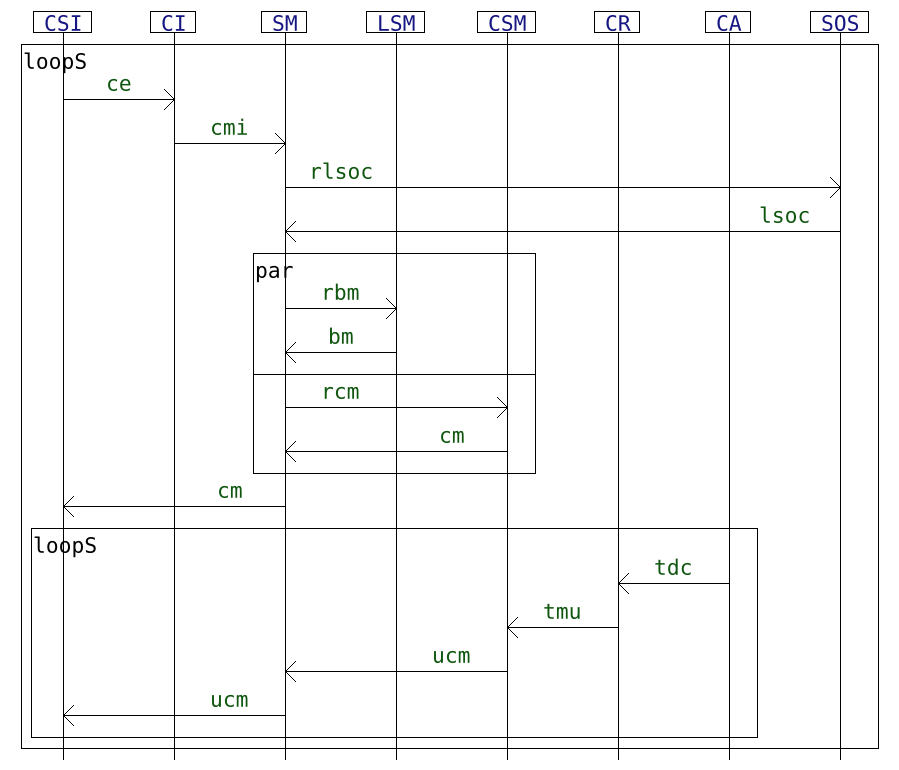
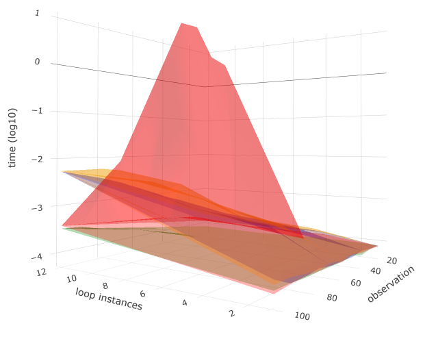
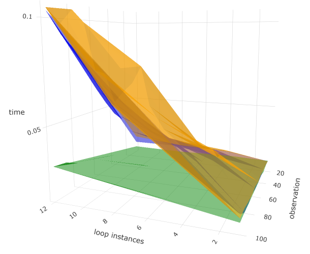
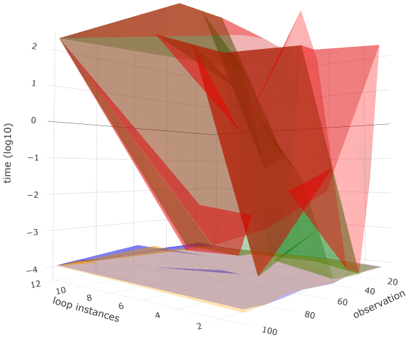
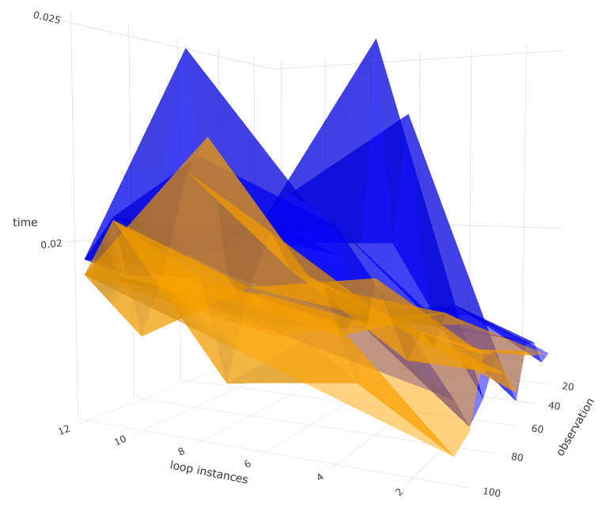

# A small experiment to compare hiding and simulation with and without local analyses in HIBOU

This set of experiments compare techniques to identify partially observed executions of distributed systems. Those take the form of multi-traces i.e. sets of local traces, each corresponding to a sequence of communication actions (emissions or receptions of messages) that were observed locally on a specific subsystem. 
A multi-trace is hence a collection of local observations of the same global behavior (which is what was executed in the distributed system).

With no hypothesis on mechanisms to synchronise the end of osbervations across the subsystems, it might be so that logging ceases too early on some subsystems.
As a result, some actions may be missing at the end of some local traces of the multi-trace.
Hence we need to be able to recognize prefixes (in the sense of multi-traces) of accepted behaviors and to distinguish between those partially observed multi-traces and multi-trace which contain actual deviations from the specification.

As for reference specification, we use Interaction models, which are formal models that can be graphically represented in a
fashion similar to UML sequence diagrams.

See "[hibou_label](https://github.com/erwanM974/hibou_label)" for the tool that is experimented on.

## Input interaction model

We propose as a usecase a non-trivial interaction model inspired from the sequence diagram found in "A dynamic and context-aware semantic mediation service for discovering and fusion of heterogeneous sensor data".

## Input Multi-traces

With the "script_generate.py" Python script:
- we generate a number of multi-traces which are exactly accepted by the aforementioned interaction model. Those generated multi-traces correspond to between 1 and 12 instantiations of the outer loop (repetitions of the global behavior) that can be seen above.
- we also generate prefixes (in the sense of multi-traces) of those multi-traces by removing actions at the end of local components until a certain "percentage" of observation is reached (the length is reduced until this "observation" percentage of the original length is reached).
- for all those generated multi-traces, we also build mutants by adding an unexpected action at the end of a random component.

## Comparing different methods

The goal of HIBOU is here to recognize the multi-traces as either prefixes of accepted multi-traces or deviations from the specification (the interaction model).

In order to do this, we can use two main methods:
- using simulation steps to fill-in the gaps caused by the lack of observation (due to missing actions at the end of local components)
- using hiding steps to resume the analysis on a smaller model once a component has been entirely emptied-out during the analysis

We can complement those methods by a technique to reduce the search space and which consists in performing local analyses before treating a node in the analysis graph. If any local analysis fails then the node doesn't have to be treated and this mechanically reduces the size of the search space.

Hence we compare 4 different algorithms. With the "script_perfs.py" Python script we perform the analyses on the multi-traces generated by the previous script against the four models (".hsf" files), each containing information about the interaction model and the corresponding configuration for the analysis.

This script then generates a "sensor_mediation.csv" file containing data about the time required to recognize the multi-traces.

## Results

With the "plot_sensor_exp_hibou.r" R script, we plot the data stored in "sensor_mediation.csv" and obtain the following 4 diagrams.

|             | log scale   | normal scale|
| ----------- | ----------- | ----------- |
| correct     |  |  |
| deviations  |  |  |

In those plots:
- the *x* axis corresponds to a length of the original multi-trace (expressed in terms of the number of times the outer loop is instantiated)
- the *y* axis corresponds to a percentage of observation. At $100$ it is fully observed, at $y < 100$ actions are randomly removed until the length is $y/100$ of the original
- the *z* axis corresponds to the time taken to correctly recognize the multi-trace.

Results related to the recognition of accepted prefixes are represented on the first row while those related to that of erroneous multi-trace are on the second row.
Let us remark the logarithmic scale on the two leftmost plots.

The 4 coloured surfaces each correspond to a method/algorithm. 
In order to deal with partial observation, we can either use hiding steps or use simulation steps to fill-in missing actions. 
In order to reduce the search space we may or may not use local analyses. 
Hence we have $4$ surfaces, each corresponding to a combination of techniques:
- in *blue* using hiding with local analyses
- in *yellow* using simulation with local analyses
- in *green* using hiding without local analyses
- in *red* using simulation without local analyses

For accepted prefixes, we can remark that the most efficient method is that using hiding without local analyses.
Using simulation steps is more costly, especially when the multi-trace is somewhat partially observed.
Indeed, if it is fully observed or almost not observed then both methods are equivalent.
This can be explained by the fact that each hiding step can correspond to many possible sequences of simulation steps.
The use of local analyses allow to quickly determine that a path cannot yield a positive verdict (acceptance/*Pass*).
However, given that we are here in the case of accepted prefixes, this most often only adds an overhead which does not facilitate the termination of the search.

For mutants (which we are sure are not accepted), the use of local analyses considerably reduces the time required to obtain a *Fail* verdict.
In fact, for the bottom left plot, we have saturated the results using a timeout (for practical reasons).
Both methods which do not use local analyses are unusable in practice for non-trivial examples.
Let us remark that the surfaces in this row appear more chaotic than in the first.
This is because the erroneous action is added at the end of a component of the multi-trace randomly and those components may have various sizes.
Let us also remark that in the bottom-right plot, both methods have similar performances.
We do not observe a notable difference between hiding and simulation because the analysis stops immediately at the first node once it observes that one of the local analyses yields a *Fail*.
Therefore no hiding steps neither simulation steps are used.

From those experiments we can surmise that using hiding steps and local analyses is the best compromise to be able to quickly recognize both accepted prefixes and erroneous multi-traces.