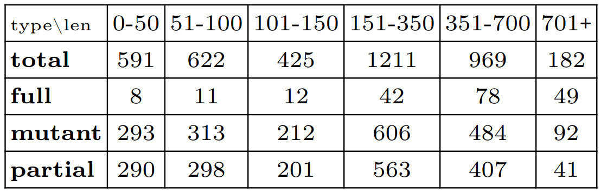
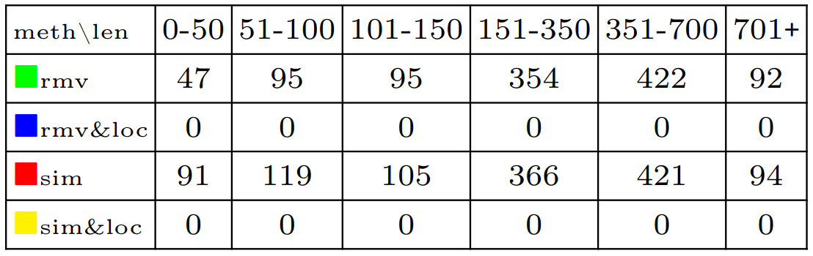
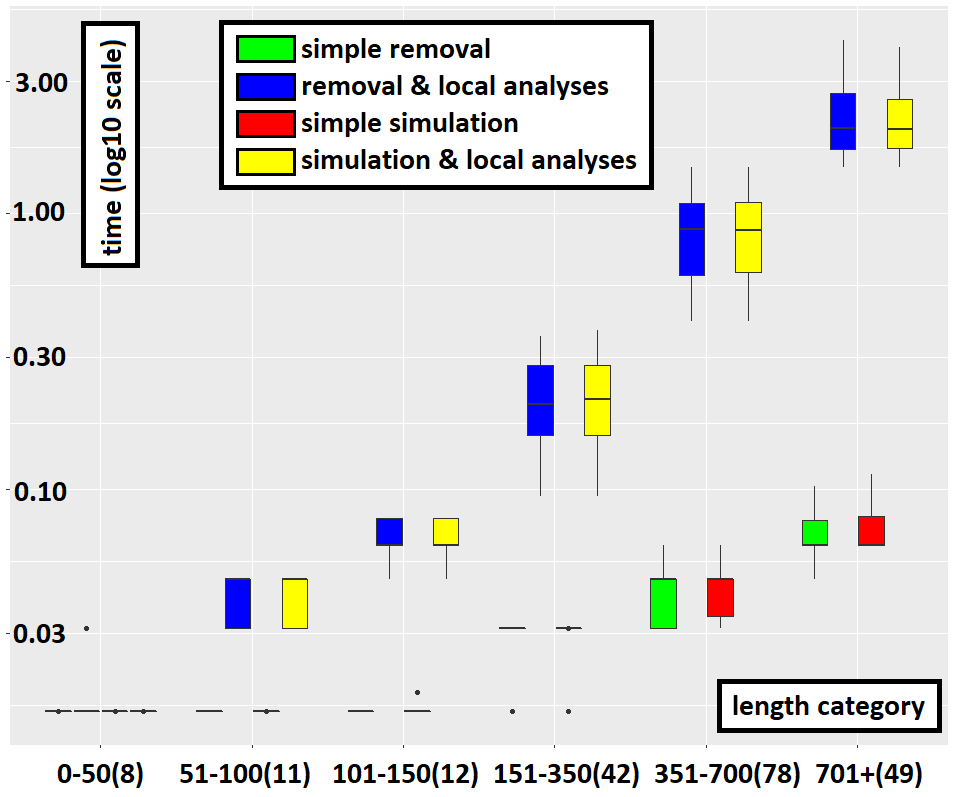
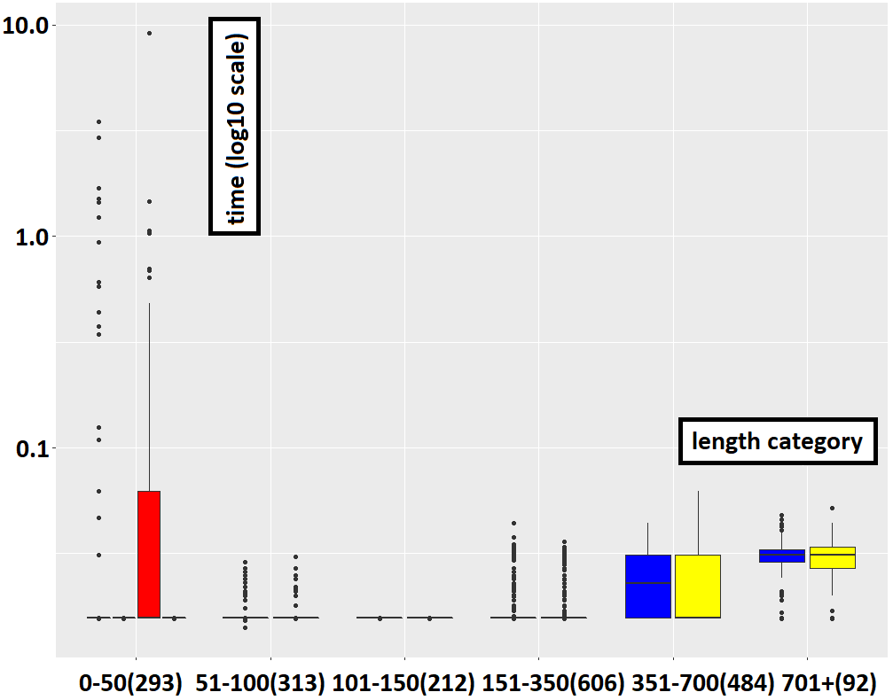
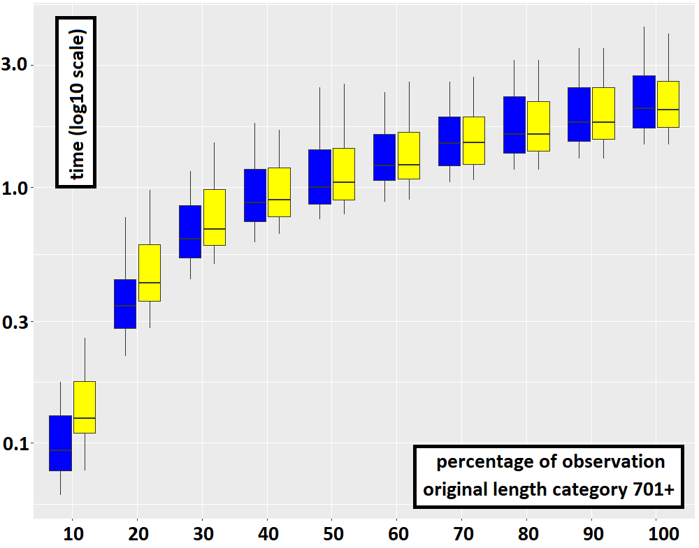

# A small experiment to compare hiding and simulation with and without local analyses in HIBOU

This set of experiments compare techniques to identify partially observed executions of distributed systems. Those take the form of multi-traces i.e. sets of local traces, each corresponding to a sequence of communication actions (emissions or receptions of messages) that were observed locally on a specific subsystem. 
A multi-trace is hence a collection of local observations of the same global behavior (which is what was executed in the distributed system).

With no hypothesis on mechanisms to synchronise the end of observations across the subsystems, it might be so that logging ceases too early on some subsystems.
As a result, some actions may be missing at the end of some local traces of the multi-trace.
Hence, we need to be able to recognize prefixes (in the sense of multi-traces) of accepted behaviors and to distinguish between those partially observed multi-traces and multi-trace which contain actual deviations from the specification.

As for reference specification, we use Interaction models, which are formal models that can be graphically represented in a
fashion similar to UML sequence diagrams.

See "[hibou_label](https://github.com/erwanM974/hibou_label)" for the tool that is experimented on.

## Input interaction model

We propose as a use case a non-trivial interaction model inspired from the sequence diagram found in "A dynamic and context-aware semantic mediation service for discovering and fusion of heterogeneous sensor data".

## Input Multi-traces

With the "exp_generate.py" Python script:
- we generate a number of multi-traces which are exactly accepted by the aforementioned interaction model. Those generated multi-traces correspond to between 1 and 40 instantiations of the outer loop (repetitions of the global behavior) that can be seen above.
- we also generate prefixes (in the sense of multi-traces) of those multi-traces by removing actions at the end of local components until a certain "percentage" of observation is reached (the length is reduced until this "observation" percentage of the original length is reached).
- for all those generated multi-traces, we also build mutants by adding an unexpected action at the end of a random component.

## Comparing different methods

The goal of HIBOU is here to recognize the multi-traces as either prefixes of accepted multi-traces or deviations from the specification (the interaction model).

In order to do this, we can use two main methods:
- using simulation steps to fill-in the gaps caused by the lack of observation (due to missing actions at the end of local components)
- using hiding steps to resume the analysis on a smaller model once a component has been entirely emptied-out during the analysis

We can complement those methods by a technique to reduce the search space and which consists in performing local analyses before treating a node in the analysis graph. If any local analysis fails then the node doesn't have to be treated and this mechanically reduces the size of the search space.

Hence we compare 4 different algorithms. With the "script_perfs.py" Python script we perform the analyses on the multi-traces generated by the previous script against the four models (".hsf" files), each containing information about the interaction model and the corresponding configuration for the analysis.
In order to smooth the results, we retain, for each run, the median of 5 tries, as the time required for the analysis.

This script then generates a "senmed.csv" file containing data about the time required to recognize the multi-traces.

The "sendmed_1to40.csv" contains such a table and this generated data has been used to draw the plots in the following.

## Results

With the "sensor_exp_hibou_data.r" R script, we analyze and plot the data stored in the previously obtained .csv table.

In the following we present what was obtained in the "senmed_1to40.csv" table.
In this sample we have 16000 data points for the application of the 4 methods to 4000 multi-traces.
The table below summarizes the nature of those 4000 multi-traces, we have:
- 200 original fully observed accepted multi-traces of lengths between 13 and 967
- 1800 prefixes of those 200 original multi-traces, each corresponding to a percentage of observation (in terms of number of actions) between 10 and 90. In order to obtain such a prefix, actions are randomly removed at the end of the components of an original multi-trace until the percentage of observation is reached.
- 2000 mutants which, via the addition of an unexpected event, are guaranteed to deviate from the specification and hence, if analyzed, will yield a Fail verdict

Those 4000 multi-traces can be categorized by length as done in the table below. For instance, we have a total of 591 multi-traces of length between 0 and 50 (in number of actions).

In order to deal with partial observation, we can either use hiding steps or use simulation steps to fill-in missing actions. 
In order to reduce the search space we may or may not use local analyses. 
Hence we have $4$ methods, each corresponding to a combination of techniques and a color in the plots:
- in *blue* using hiding with local analyses
- in *yellow* using simulation with local analyses
- in *green* using hiding without local analyses
- in *red* using simulation without local analyses

Each one of the 4 methods was used to analyze the 4000 multi-traces. The experiment was run using an i5-8250U processor and 32Go of RAM.
In order to generate the 16000 data points, we have set a timeout of 10s for the maximum time an analysis can take. 

Both methods which use local analyses can analyze all of the 4000 multi-traces under 10s. 
However, without applying local analyses, the timeout can be exceeded.
It is the case for 1105 multi-traces for the method which uses hiding steps without local analyses 
and for 1196 multi-traces for the method which uses simulation steps without local analyses.
Details are given on the table below.

Yet, the use of local analyses constitutes an overhead for the treatment of each node of the search graph.
Hence it comes at a cost, which may not be beneficial in all cases. 
Indeed, local analyses allows one to recognize certain deviations from the specification earlier in the analysis.
However, they do not help in determining that no deviation occurs i.e. that the multi-trace is accepted.
Hence, in the case of fully observed accepted multi-traces, using local analyses only increases the overall cost of analysis as illustrated below.

However, in all other cases (strict prefixes and mutants), 
using local analyses considerably reduces the cost of analysis.
This is obvious from the cases where the methods removal-only and simulation-only exceed the timeout for longer multi-traces while those that use local analyses do not.
For smaller multi-traces this effect is still visible, as illustrated below.
Even in log scale when plotting the data,
the time required to recognize failure multi-traces without using local analyses pulls down that of recognizing them with local analyses.
In practice, and on non-trivial use cases, both methods which do not use local analyses are unusable. 

Using simulation steps can be more costly than hiding steps, all the more so the more the multi-trace is partially observed.
Indeed, if it is fully observed or almost not observed then both methods are equivalent.
This can be explained by the fact that each hiding step can correspond to many possible sequences of simulation steps.
The plot below underlines this (notice the difference at very low percentages of observation).

## Remarks

Using simulation steps is a viable alternative to using hiding steps.
However, while we have proven the correctness of the approach with hiding steps, we have not yet done so with simulation steps.
To limit the number of simulation steps, we only introduce missing events for a maximum of one iteration of each loop.
This appears to be sufficient to get the same results as the method based on hiding steps.

The use of local analyses allow to quickly determine that a path cannot yield a positive verdict (acceptance/*Pass*).
However, in the case the multi-trace does not deviate from the specification,
this most often only adds an overhead which does not facilitate the termination of the search.

For mutants (which we are sure are not accepted), the use of local analyses considerably reduces the time required to obtain a *Fail* verdict.
In that case, we do not observe a notable difference between hiding and simulation because the analysis stops immediately at the first node once it observes that one of the local analyses yields a *Fail*.
Therefore no hiding steps neither simulation steps are used.

From those experiments we can surmise that using hiding steps and local analyses is the best compromise to be able to quickly recognize both accepted prefixes and erroneous multi-traces.